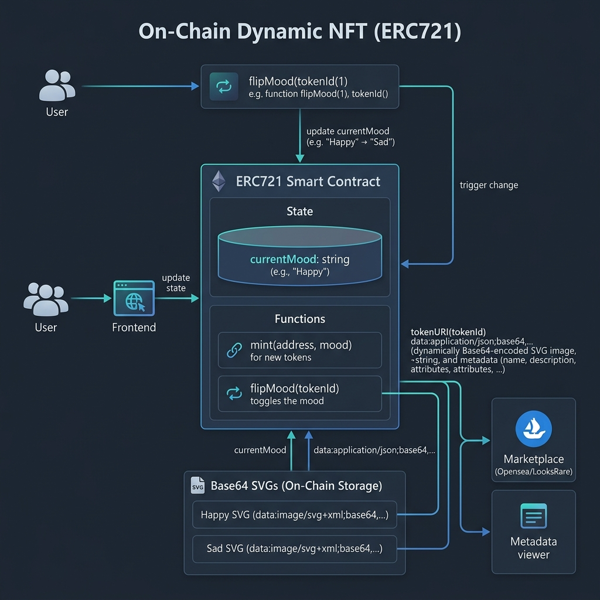

# MoodNFT — On-Chain Dynamic NFT

> A fully on-chain, dynamic ERC-721 NFT whose artwork **lives entirely on the blockchain** — no IPFS, no external servers. Each token reflects the emotional state of its owner, toggling between a happy 😊 and a sad 😢 SVG image, both encoded as Base64 directly in the `tokenURI`.

---

## Architecture



### On-Chain Metadata Flow

```
tokenURI(id)
    │
    ├── read s_tokenIdToMood[id]  (HAPPY or SAD)
    │
    ├── select imageURI (happy or sad SVG)
    │
    └── return:
        "data:application/json;base64," + Base64.encode({
            "name": "Mood NFT",
            "description": "An NFT that reflects the owners mood.",
            "attributes": [{"trait_type": "moodiness", "value": 100}],
            "image": "<base64-encoded SVG>"
        })
```

---

## Project Structure

```
NFT/
└── BasicNFT/
    ├── src/
    │   └── MoodNft.sol        # Core NFT contract
    ├── script/                # Foundry deploy scripts
    ├── test/                  # Forge unit tests
    ├── lib/                   # Foundry dependencies (OpenZeppelin)
    ├── img/                   # Source SVG files (happy/sad)
    ├── foundry.toml
    └── Makefile
```

---

## How It Works

### Minting

Anyone can call `mintNft()` to receive a new token. Tokens are minted with `HAPPY` mood by default. Token IDs are sequential starting from `0`.

### Flipping Mood

Only the **token owner or an approved operator** can call `flipMood(tokenId)`. The function uses OpenZeppelin's `_isAuthorized` check to enforce ownership.

```solidity
function flipMood(uint256 tokenId) public {
    if (!_isAuthorized(ownerOf(tokenId), msg.sender, tokenId))
        revert("Not owner nor approved");
    // toggles HAPPY ↔ SAD
}
```

### Fully On-Chain SVG

Both happy and sad SVG images are passed to the constructor as **Base64-encoded strings** at deployment. They are stored in contract storage and embedded directly into the `tokenURI` output — no external dependencies after deployment.

---

## Getting Started

### Prerequisites

- [Foundry](https://book.getfoundry.sh/) installed

```bash
curl -L https://foundry.paradigm.xyz | bash
foundryup
```

### Install Dependencies

```bash
forge install
```

### Build

```bash
forge build
```

### Run Tests

```bash
forge test -v
```

### Deploy (local Anvil)

```bash
# Start local node
anvil

# Deploy
forge script script/DeployMoodNft.s.sol --rpc-url http://localhost:8545 --private-key <PRIVATE_KEY> --broadcast
```

### Deploy to Sepolia

```bash
forge script script/DeployMoodNft.s.sol \
  --rpc-url $SEPOLIA_RPC_URL \
  --private-key $PRIVATE_KEY \
  --broadcast \
  --verify \
  --etherscan-api-key $ETHERSCAN_API_KEY
```

Or use the Makefile:

```bash
make deploy-sepolia
```

---

## Key Features

| Feature | Detail |
|---|---|
| ✅ 100% On-Chain | Metadata and images stored entirely on-chain — no IPFS |
| ✅ Dynamic NFT | Token artwork changes state via `flipMood()` |
| ✅ Base64 SVG | Images encoded as data URIs, directly in `tokenURI` |
| ✅ ERC-721 Compliant | Built on OpenZeppelin's audited ERC-721 implementation |
| ✅ Access Control | Only owner/approved can mutate token state |

---

## Test Coverage

Tests cover:
- NFT minting and token ID increments
- Default mood assignment (`HAPPY` on mint)
- Mood flipping by owner
- Access control (non-owner cannot flip)
- `tokenURI` returns valid Base64 JSON with correct image URI

---

## Tech Stack

- **Solidity** `^0.8.10`
- **Foundry** (Forge, Anvil, Cast)
- **OpenZeppelin** (`ERC721`, `Base64`)

---

## License

MIT
